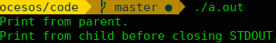

# PRÁCTICA 1 - PROCESOS

* Carlos Daniel Montoya Hurtado
* León Darío Arango Amaya


1. **Escriba un programa que llame un ```fork()```. Antes del llamado del ```fork()```, declare una variable de acceso (por ejemplo, ```x```) y asígnele un valor (por ejemplo, ```100```). Responda las siguientes preguntas:**
  * **¿Cuál es el valor de la variable en el proceso hijo?**
  Al realizar un llamado a ```fork()``` se crea un nuevo proceso con una copia del espacio de direcciones del proceso padre, por lo que la variable ```x``` tendrá el mismo valor que el del proceso padre en el momento en que se crea, pero después de eso, cada ```x``` puede tomar su propio valor independiente, ya que los espacios de direcciones son privados para cada proceso.

  * **¿Qué sucede con la variable cuando el proceso hijo y el padre cambian el valor de ```x```?**
  Cada ```x``` tendrá su propio valor, ya que cada variable se ubica en el espacio de direcciones de su respectivo proceso y no interfiere con el otro.

2. **Escriba un programa que abra un archivo (con la llamada ```open()```) y entonces llame a ```fork()```. **Nota**: El siguiente [enlace](https://www.geeksforgeeks.org/input-output-system-calls-c-create-open-close-read-write/) puede ser de utilidad para entender la llamada ```open()```.**
  * **¿Pueden el padre y el hijo acceder al file descriptor retornado por ```open()```?**
  Sí, porque el descriptor se obtiene **antes** de hacer el llamado a ```fork()```.

  * **¿Qué pasa si ellos empiezan a escribir el archivo de manera concurrente, es decir, a la misma vez?**
  Primero acaba de escribir un proceso y luego lo hace el otro, al parecer el que acaba de primero es el padre.

3. **Escriba un programa usando ```fork()```. El proceso hijo imprimirá ```"Hello"```; el proceso padre imprimirá ```"goodbye"```. Usted deberá asegurar que el proceso hijo imprima en primer lugar; ¿usted podría hacer esto sin llamar ```wait()``` en el padre?**
Sí, llamando a ```sleep()```.

4. **Escriba un programa que llame ```fork()``` y entonces llame alguna forma de ```exec()``` para correr el programa ```/bin/ls```. Intente probar todas las variaciones de la familia de funciones ```exec()``` incluyendo (en linux) ```execl()```, ```execle()```, ```execlp()```, ```execv()```, ```execvp()``` y ```execvpe()```. ¿Por qué piensa usted que existen tantas variaciones para la misma llamada básica?**
Para ejecutar un programa dependiendo de las necesidades del programador, pues puede ser más fácil hacer ejecutar un programa de una forma u otra dependiendo del contexto. Las letras que van después de ```exec``` representan la forma en que se pasan los parámetros de ejecución:

    * l: se pasan los argumentos como una lista, uno por uno.
    * v: se pasan los argumentos como dentro de arreglo.
    * p: ubicación para buscar el nuevo programa.
    * e: ambiente.


5. **Escriba ahora un programa que use ```wait()``` para esperar que el proceso hijo finalice su ejecución. ¿Cuál es el valor de retorno de la función ```wait()```?, ¿Qué pasa si usted usa la función ```wait``` en el hijo?**
Al padre le retorna el PID del hijo. Cuando se usa en un hijo el retorno es -1, indicando un error.

6. **Haga un programa, como el del ejercicio anterior, con una breve modificación, la cual consiste en usar ```waitpid()``` en lugar de ```wait()```. ¿Cuándo podría ser ```waitpid()``` útil?**

Es útil utilizarlo cuando se tienen multiples hijos, ya que podemos determinar cual suspende su ejecución de una forma mas controlada especificando como algumento el pid.

7. **Escriba un programa que cree un proceso hijo y entonces en el proceso hijo cierre la salida estandar (```STDOUT FILENO```). ¿Qué pasa si el hijo llama ```printf()``` para imprimir alguna salida después de cerrar el descriptor?**
Después de cerrar la salida estándar, la función ```printf()``` deja de escribir en la consola. En la imagen siguiente se ve que sólo hay un mensaje antes de cerrar la salida, no se imprime el que va después.



8. Escriba un programa que cree dos hijos y conecte la salida estándar de un hijo a la entrada estándar del otro usando la llamada a sistema ```pipe()```

## 3. Entregable ##

Los entregables para esta practica incluiran:
1. Codigo de los ejercicos propuestos.
2. Solución a las preguntas planteadas. apoyar la explicación con graficas donde lo vea necesario.
